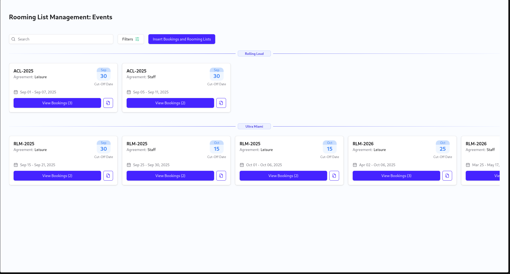
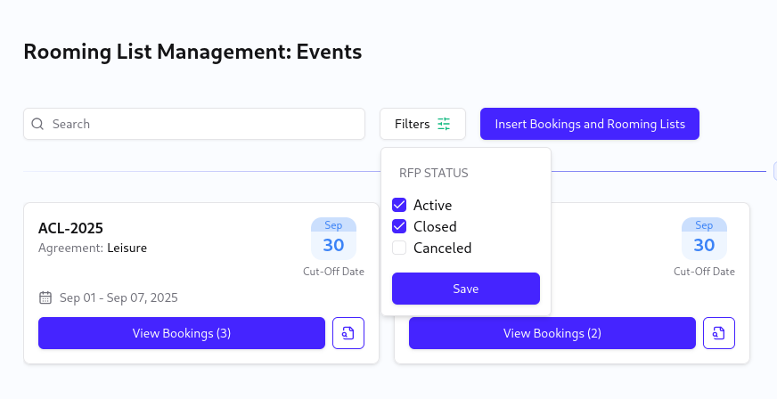
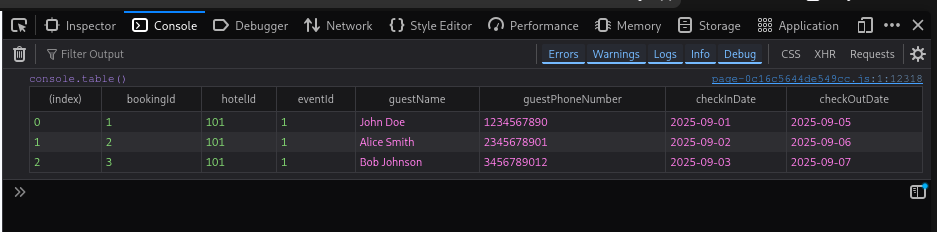
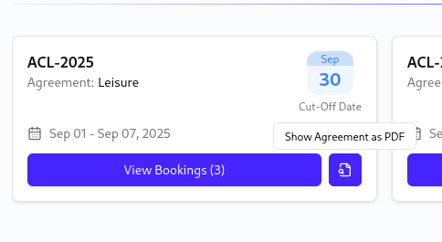

# Crewfare Rooming List Management App #

Next.js frontend application designed to event management. Built with server side rendering with NextJS, TypeScript, TailwindCSS and other modern tools. Provides a seamless experience for listing rooming lists grouped by their events.

## Live ##

Explore the deployed project:

- **Live Demo** - [https://crewfare-rooming-list-panel.vercel.app/](https://crewfare-rooming-list-panel.vercel.app/)

- **Backend Docs** - [https://crewfare-rooming-list-api.onrender.com/api](https://crewfare-rooming-list-api.onrender.com/api)

## Installation Steps ##

To get the project up and running:

1. Clone the repo:

  ```shell
  git clone https://github.com/lucasd09/crewfare-rooming-list-panel.git
  cd crewfare-rooming-list-panel
  ```

2. Install dependencies using **[pnpm](https://pnpm.io/installation)**:

  ```shell
  pnpm install
  ```
3. If you want to run locally, create a .env file and put the following lines:

  ```
  API_URL="http://localhost:3000"

  ```

4. Start the application:

  ```shell
  pnpm dev
  ```

## Design System and Documentation ##

**Storybook** is fully integrated, providing a very rich documentation and examples of all components.

You can run it with:

```shell
  pnpm storybook
```

## Project Screenshots ##

### Lists grouped by events ###



### Filters ###



### Bookings listing ###



### See agreement as PDF tooltip ###



## Features ##

Here're some of the project's best features:

- Granular commits following the **[Conventional Commits Specs](https://www.conventionalcommits.org/en/v1.0.0/)**
- Integration with the backend using Next.js actions.
- A vertical stepper for easy navigation.
- Pixel Perfect implementation of base design.

## Built with ##

Technologies used in the project:

- NextJs
- React
- TailwindCSS
- Typescript
